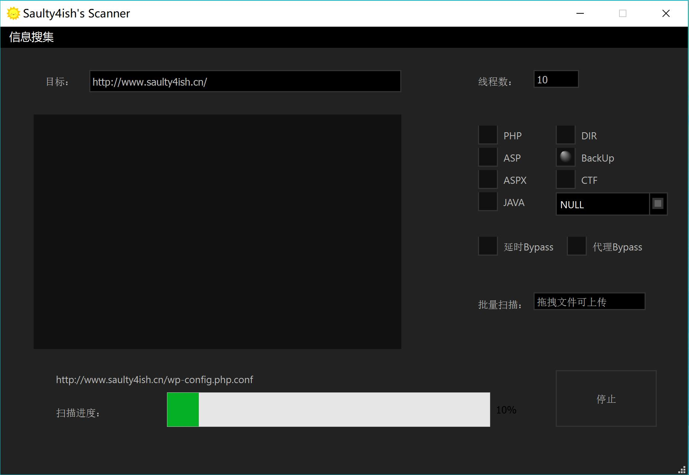
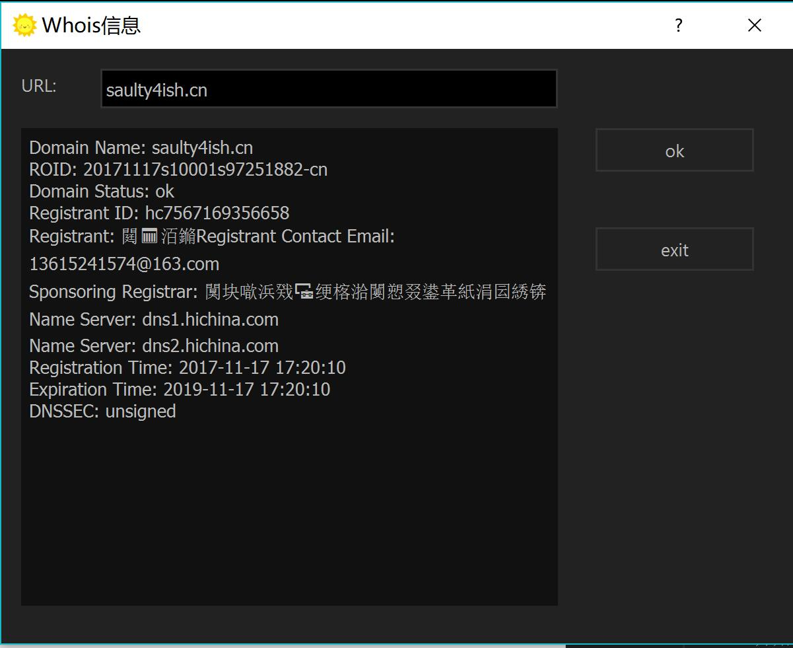
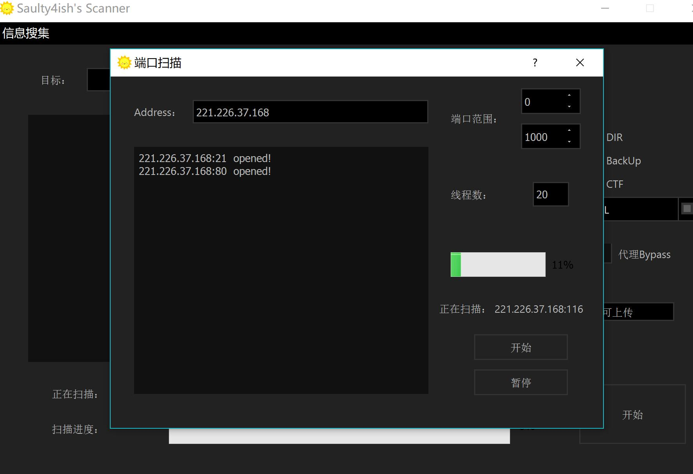

# Dir_Scan_ByQT5

> QT实现仿御剑风格路径扫描工具，增加代理延时Bypass功能，同时支持批量扫描，附加whois查询，端口扫描模块。

#### 路径扫描：

* 代理bypass: config/proxy/proxy文件下是代理列表(仅支持http)，每次请求自动选取随机代理。

* 延时bypass: 每次请求后sleep 3s。

* 批量扫描: 直接拖拽文件置于窗口，选取字典即可。

> url格式有要求，一定是http[s]?://[S]+/。

#### whois信息查询：

#### 端口扫描：

> 简单的qt demo，可扩展模块水毕设之类的，实际使用正在测试中。
